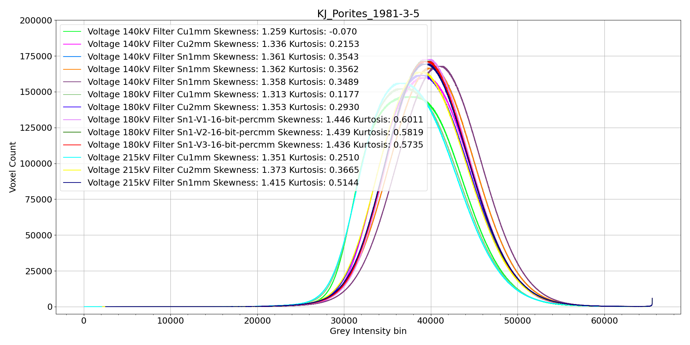

The code found in [Histogram_overlays.py](Histogram_overlays.py) creates plots of X-ray histograms of replicate scans under optimal settings.

Data are available on [CoralHistograms](../Data/CoralHistograms)

Below is an example of replicate scans of a coral specimen under optimal settings. These are all **raw reconstructions** (i.e., not corrected for Beam Hardening artifact)

  

