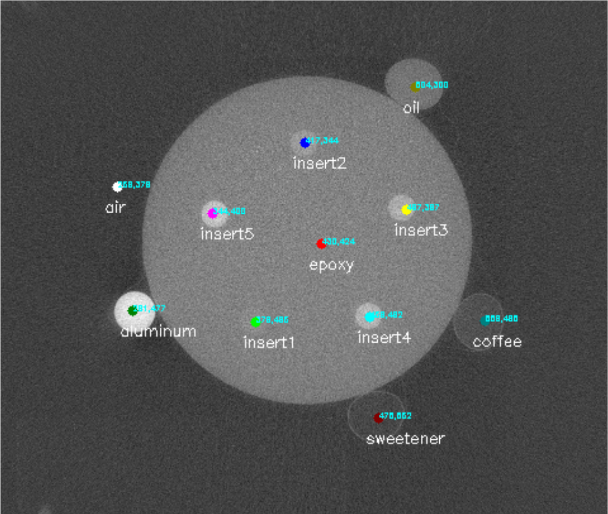
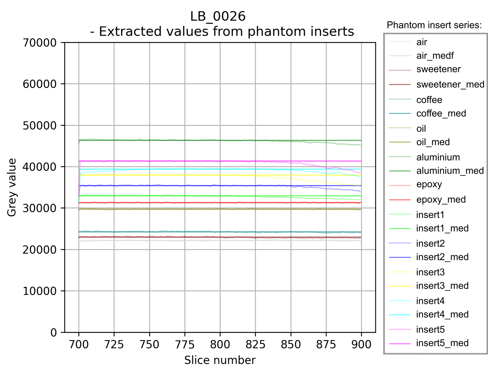

# Density calibration curves via semi-automated extraction of phantom inserts

Below is a guide on how to perform semi-automated extraction of density standards embedded and also attached to a radiology phantom disc.

## Step 1 - Phantom range from X-ray stack 

### 1.1 Export X-ray stack
Generate a .tif stack containing slices of the entire scan. You can use Avizo® to export an image stack of the entire volume or 
[Fiji/ImageJ](https://imagej.net/software/fiji/) using the utility plugin provided [Vol_2Any_LEO.py](Vol_2Any_LEO.py)
This utility plugin creates a TIFF folder containing the XY stack within each scan directory saved under a root directory. 

See example below:


### 1.2 Select phantom range
Select only part of the stack containing the phantom and where all inserts are visible (including attached materials).
Make sure both the top and bottom slices have all the materials as you'll be prompted to mark them. 


### 1.3 Copy phantom slice range to the right directory 
Copy the slice range to ProjecRoot/ScanXX/STANDARD_EXTRACT/PhantomStack. 

**A general representation of the directory tree showing the folder structure is as follows:**

```.
├── Project Root/
├── Scan1
├── Scan2
├── Scan3
├── Scan4/
│   ├── STANDARD_EXTRACT/
│   │   ├── STANDARD_EXTRACTED_VALUES_Scan4.xlsx
│   │   ├── Phantom_Stack
│   │   ├── Overlay_Extracted_vals_Scan4.png
│   │   └── Phantom_Masks/
│   │       └── Phantom_mask_slice_0001.png
│   ├── TIFF/
│   │   ├── Scan4_Slice_xy_0001.tif
│   │   └── Scan4_Slice_xy_0002.tif
│   ├── Scan4.vgi
│   ├── Scan4.xtekVolume
│   ├── Scan4.raw
│   ├── Histogram-Scan4.csv
│   └── Phantom_Fittings_and_Weights.xlsx
└── Scan5

```

## Step 2 - Run Phantom Extraction code 
 
Run [SemiAutomated_Extraction_Phantom.py](SemiAutomated_Extraction_Phantom.py) from any Terminal (e.g., Windows PowerShell) by
specifying a phyton installation from an environment in which all [requirements.txt](https://github.com/LeoBertini/CoralMethodsPaper/blob/main/requirements.txt) have been installed. 

You will be prompted to specify the ProjectRoot, then you will be asked to mark phantom inserts on all scans inside ProjectRoot on just the top and bottom slices of phantom stacks.

You will be asked to import a template spreadsheet [PhantomDetails.xlsx](PhantomDetails.xlsx) containing details of your Phantom and then enter which type of phantom design you are adopting (Extended or Normal). 
After this, you'll click on the centre of each insert and type their names in the screen (as shown below).
Make sure you also probe for 'air' in an area that is free from artifacts or noise from materials used to wrap the sample.


After marking on all available inserts on the top slice of the stack, you choose a scaling factor to expand the sampled area inside each insert.
This scaling factor allows for adjustments across scans of different resolutions (usually a scaling factor between 200-300 is ideal for scans with resolutions between 50-100 µm)
Then, the bottom slice will be brought forward for marking. Initial positions on the top slice are shown as 'red dots' for guidance. 

After marking the inserts again, positions across the entire phantom stack are predicted and greyscale values extracted.
A phantom's bottom slice which was marked for probing areas looks like this:



The results are saved on a spreadsheet *'STANDARD_EXTRACTED_VALUES_ScanXX.xlsx'*.
A plot of the greyscale series and median grey values for each insert is also created for diagnostic purposes.



